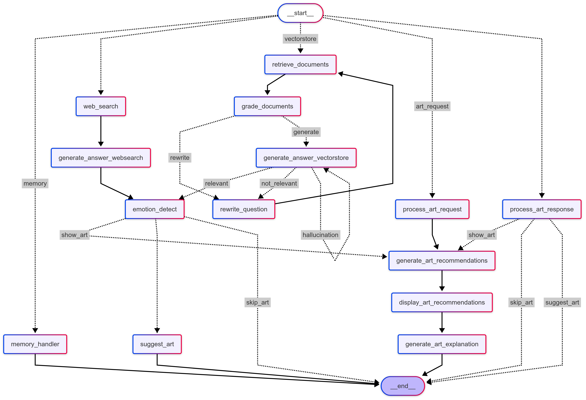

# ArtiTech: 적응형 미술 작품 추천 시스템

## 📊 LangGraph Visualization


## 개요

이 프로젝트는 미술 작품 추천기와 결합된 적응형 검색 증강 생성(RAG) 시스템을 구현합니다. 주요 목표는 공감적인 대화를 나누고, 사용자의 감정을 이해하며, 정서적 웰빙을 지원하기 위해 관련 미술 작품이나 창의적인 활동을 제안할 수 있는 AI 어시스턴트를 만드는 것입니다.

이 시스템은 LangChain과 LangGraph를 활용하여 유연하고 상태를 저장하는 워크플로우를 구축합니다. 미술 작품 추천을 위해 텍스트와 이미지를 모두 이해하는 멀티모달 CLIP 임베딩을 사용하며, 웹 검색, 문서 검색, 감정 감지 등 다양한 기술을 통합하여 문맥적으로 관련성 있고 지원적인 응답을 제공합니다.

## 주요 기능

*   **적응형 RAG:** LangGraph를 사용하여 문맥, 감지된 감정, 중간 결과(예: 문서 관련성)에 따라 쿼리를 동적으로 라우팅하는 워크플로우를 생성합니다.
*   **감정 감지:** 사용자 입력을 분석하여 미리 정의된 목록에서 감정을 감지하고, 대화 흐름 및 미술 제안에 영향을 줍니다.
*   **미술 작품 추천:**
    *   OpenAI의 CLIP 모델을 활용하여 감정 프롬프트와 의미적으로 관련된 미술 작품을 찾습니다.
    *   색상 분석(주요 색상)을 통합하여 추천 관련성을 향상시킵니다.
    *   감정, 색상, 주제, 스타일에 대한 사전 정의된 매핑을 사용합니다.
    *   FAISS(설치된 경우)를 사용하여 효율적인 유사성 검색을 지원합니다.
*   **하이브리드 검색:** 키워드 검색(BM25)과 의미론적 검색(FAISS)을 결합한 `EnsembleRetriever`를 사용하여 PDF 소스에서 강력한 문서 검색을 수행합니다.
*   **웹 검색 기능:** Tavily Search를 통합하여 로컬 문서 범위를 벗어난 쿼리에 답변합니다.
*   **환각 및 관련성 평가:** 생성된 응답이 검색된 컨텍스트에 근거하고 사용자의 쿼리와 관련이 있는지 확인하는 단계를 포함합니다.
*   **대화 메모리:** 세션 내에서 문맥 인지 상호작용을 위해 대화 기록을 유지합니다.
*   **설정 가능:** 모델 이름, 파일 경로, 기능 플래그와 같은 주요 매개변수는 `src/config.py`를 통해 관리됩니다.
*   **캐싱:** 생성된 미술 작품 임베딩을 캐시하여 후속 실행 시 초기화 속도를 높입니다.

## 프로젝트 구조

```
.
├── data/                     # 프로젝트 데이터 파일
│   ├── art_csv/              # 미술 작품 메타데이터 CSV 파일
│   │   └── painting_info_with_descriptions.csv  # 예시 미술 작품 데이터 파일
│   ├── docs/                 # RAG 시스템용 PDF 문서
│   │   └── ... (PDF 파일들)
│   └── images/               # 미술 작품 이미지 파일 (Object ID로 명명됨)
│       └── ... (예: 12345.jpg)
├── notebooks/                # 실험 및 상호작용용 Jupyter 노트북
│   └── artitech_final.ipynb  # 시스템 시연용 메인 노트북
├── scripts/                  # 보조 스크립트
│   ├── emotion/              # 감정 처리 및 그래프 라우팅 관련 스크립트
│   │   ├── __init__.py
│   │   ├── art_recommendation_connector.py
│   │   ├── art_response_handler.py
│   │   ├── art_suggestion.py
│   │   ├── emotion_detection.py
│   │   └── multi_turn_router.py
│   ├── __init__.py
│   └── fix_api_key.py        # API 키 설정 유틸리티
├── src/                      # 핵심 애플리케이션 로직 소스 코드
│   ├── __init__.py
│   ├── artwork_recommender.py # 미술 작품 임베딩 및 추천 핵심 클래스
│   ├── chain.py              # LangChain RAG 체인 생성 함수
│   ├── config.py             # 설정 (경로, 모델, 플래그)
│   ├── data_processing.py    # PDF 로딩 및 분할 유틸리티
│   ├── display_utils.py      # 추천 결과 표시 유틸리티
│   ├── emotion_nodes.py      # 감정 감지 관련 LangGraph 노드
│   ├── grading.py            # 관련성/환각 평가용 LangChain 컴포넌트
│   ├── graph_builder.py      # 메인 LangGraph 워크플로우 빌드
│   ├── graph_nodes.py        # 핵심 LangGraph 노드 (검색, 생성, 확인 등)
│   ├── prompts.py            # 다양한 시스템 및 사용자 프롬프트 정의
│   ├── recommender_setup.py  # ArtworkRecommender 초기화 로직
│   ├── retriever.py          # Retriever 생성 함수 (Ensemble)
│   ├── rewriting.py          # 쿼리 재작성용 LangChain 컴포넌트
│   ├── routing.py            # 라우팅 결정용 LangChain 컴포넌트
│   ├── state.py              # GraphState TypedDict 정의
│   └── tools.py              # 웹 검색 도구 설정 (Tavily)
├── emotion_art_cache/        # 캐시된 임베딩 기본 디렉토리 (자동 생성)
├── .env                      # API 키 (사용자가 생성해야 함)
├── requirements.txt          # 프로젝트 의존성 (사용자가 생성/확인해야 함)
└── README.md                 # 이 파일 (영문 기본)
```

## 설치 및 설정

1.  **사전 요구 사항:**
    *   Python (3.9 이상 권장)
    *   Git
    *   패키지를 설치할 수 있는 환경 접근 권한 (가상 환경 권장).

2.  **저장소 복제:**
    ```bash
    git clone <your-repository-url> # 실제 저장소 URL로 교체
    cd <your-project-directory>     # 프로젝트 루트 디렉토리로 이동
    ```

3.  **가상 환경 설정 (권장):**
    ```bash
    # Windows
    python -m venv venv
    .\venv\Scripts\activate

    # macOS/Linux
    python3 -m venv venv
    source venv/bin/activate
    ```

4.  **의존성 설치:**
    *   재현성을 위해 `requirements.txt` 파일 사용을 적극 권장합니다. 파일이 없는 경우, `.py` 파일의 import 문을 기반으로 핵심 라이브러리를 수동으로 설치해야 할 수 있습니다. 주요 의존성은 다음과 같습니다:
        ```
        langchain langchain-openai langgraph langchain-community
        pandas numpy torch transformers pillow scikit-learn tqdm
        faiss-cpu # CUDA 설정이 되어 있다면 faiss-gpu
        matplotlib python-dotenv tavily-python
        # import 문에서 확인된 기타 특정 라이브러리 추가
        ```
    *   pip를 사용하여 설치:
        ```bash
        pip install -r requirements.txt
        # 또는 개별 설치: pip install langchain langchain-openai ...
        ```
    *   **FAISS 참고:** FAISS (`faiss-cpu` 또는 `faiss-gpu`)는 미술 작품 추천 속도를 크게 향상시키지만 선택 사항입니다. FAISS가 설치되지 않은 경우 시스템은 표준(느린) 유사성 검색으로 대체됩니다.

5.  **API 키 설정:**
    *   **중요:** 이 프로젝트가 제대로 작동하려면 OpenAI 및 Tavily Search용 API 키가 필요합니다. **반드시** 자신의 키를 제공해야 합니다.
    *   프로젝트 루트 디렉토리에 `.env` 파일을 생성합니다 (없는 경우).
    *   이 `.env` 파일에 다음 형식으로 API 키를 추가합니다:
        ```dotenv
        OPENAI_API_KEY="sk-xxxxxxxxxxxxxxxxxxxxxxxxxxxxxxxxxxxxxxxxxxxxxxxx"
        TAVILY_API_KEY="tvly-xxxxxxxxxxxxxxxxxxxxxxxxxxxxxxxx"
        ```
    *   `sk-...` 및 `tvly-...`를 실제 API 키로 교체합니다.
    *   **절대로 `.env` 파일을 Git에 커밋하지 마십시오.** 포함된 `.gitignore` 파일이 이를 자동으로 방지해야 합니다.
    *   `scripts/fix_api_key.py` 스크립트(특히 노트북에서 호출되는 `setup_api_keys` 함수)는 이 `.env` 파일을 읽고 애플리케이션이 사용할 해당 환경 변수(`OPENAI_API_KEY`, `TAVILY_API_KEY`)를 설정하는 프로세스를 처리합니다. 필요한 `OPENAI_API_KEY`가 없거나 유효하지 않으면 애플리케이션은 오류 메시지와 함께 실패합니다.

6.  **데이터 설정:**
    *   **미술 작품 메타데이터:** 미술 작품 메타데이터 CSV (예: `painting_info_with_descriptions.csv`) 파일을 `data/art_csv/` 디렉토리 내에 배치합니다. `Object ID` 열이 포함되어 있는지 확인합니다 (또는 `src/artwork_recommender.py`를 적절히 수정).
    *   **미술 작품 이미지:** 해당 미술 작품 이미지 파일을 `data/images/` 디렉토리 내에 배치합니다. 이미지는 **반드시** CSV 파일의 `Object ID`에 따라 이름이 지정되어야 합니다 (예: `Object ID`가 `12345`이면 이미지 이름은 `12345.jpg`여야 함). 기본 예상 확장자는 `.jpg`입니다.
    *   **텍스트 문서:** RAG 시스템이 컨텍스트에 사용할 모든 PDF 문서를 `data/docs/` 디렉토리 내에 배치합니다.

## 사용법

시스템과 상호작용하고 시연하는 주요 방법은 Jupyter 노트북(`notebooks/artitech_final.ipynb`)을 이용하는 것입니다.

1.  **Jupyter 시작:**
    ```bash
    jupyter notebook
    # 또는 Jupyter Lab 사용:
    # jupyter lab
    ```
2.  **노트북 열기:** `notebooks` 디렉토리로 이동하여 `artitech_final.ipynb`를 엽니다.
3.  **셀 실행:** 노트북 셀을 순차적으로 실행합니다. 노트북은 다음 과정을 안내합니다:
    *   라이브러리 가져오기 및 API 키 설정.
    *   PDF 문서 및 미술 작품 데이터 로딩 및 처리.
    *   `ArtworkRecommender` 초기화 (임베딩 생성/로딩 포함).
    *   RAG 구성 요소 설정 (retriever, graders, prompts, LLM).
    *   `LangGraph` 애플리케이션 빌드 (`adaptive_rag_app`).
    *   그래프를 통해 예제 쿼리 실행.
    *   최종 응답 및 생성된 미술 작품 추천 결과 표시.
    노트북 셀을 실행하면 사용자가 시스템을 대화식으로 테스트하고 RAG 및 추천 프로세스의 단계별 실행을 관찰할 수 있습니다.

## 설정

`src/config.py`에서 몇 가지 주요 매개변수를 조정할 수 있습니다:

*   `RECOMMENDER_MODEL_NAME`: 미술 작품 임베딩에 사용되는 특정 CLIP 모델 (예: `"openai/clip-vit-large-patch14"`).
*   `CSV_PATH`: 미술 작품 메타데이터 CSV 파일 경로.
*   `IMAGE_FOLDER`: 미술 작품 이미지가 포함된 디렉토리 경로.
*   `CACHE_DIR`: 캐시된 임베딩 저장 디렉토리.
*   Matplotlib CJK 문자 지원을 위한 글꼴 설정.

`src/retriever.py`의 retriever 가중치 또는 `src/chain.py` 및 `src/grading.py` 팩토리의 LLM 매개변수(모델 이름, temperature)와 같은 기타 설정도 해당 파일 내에서 또는 노트북에서 구성 요소 초기화 중에 조정할 수 있습니다.

## 기술 상세 정보

*   **핵심 프레임워크:** LangChain & LangGraph
*   **LLMs:** OpenAI 모델 (GPT-4o, GPT-3.5-turbo가 일반적인 선택이며 설정 가능)
*   **임베딩:** OpenAI Embeddings (텍스트 RAG용), CLIP (`transformers`를 통한 멀티모달 미술 작품 추천용)
*   **벡터 검색:** FAISS (선택 사항, 미술 작품용), 내장 LangChain 벡터 저장소.
*   **키워드 검색:** BM25 (LangChain 경유)
*   **웹 검색:** Tavily Search API
*   **데이터 처리:** Pandas
*   **이미지 처리:** Pillow, NumPy
*   **시각화:** Matplotlib
